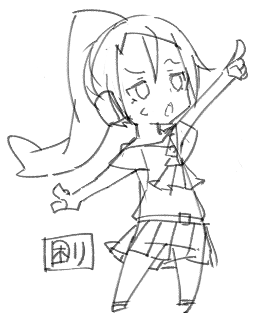

## Video

<!-- Q. 動画再生するだけのアプリで音/リズムゲームの練習になるのでしょうか？ -->
{}

Here are some things you can do to improve your practice. 
- No pausing by tapping the screen during playback 
- You can set the playback area 
- You can adjust the playback speed 
- Video expansion, contraction and movement is possible 
 
Just tapping the screen while playing the part you're weak at is good enough practice 💪 So start practicing today ♪~

{}
 

<!-- Q. 縦向きにする事は出来ますか？ -->
{}

"Video Selection" You can change the orientation by tapping the "Device is rotating" icon in the lower left corner of the screen. 
Tap again to return to landscape mode.

{}
 

<!-- Q. タッチ音を鳴らす事は出来ますか？ -->
{}

You can set up the touch sound in "Settings > Settings on Video > Sound" in the app. 
There are different types of touch sounds, so you can choose the one you like best ♪~

{}
 

<!-- Q. タッチ箇所を表示する事は出来ますか？ -->
{}

You can adjust the display settings for touch from "Settings > Settings on Video > Point" in the application. 
You can also customize the color and size of the display to make it your own. ♪~

{}
 

<!-- Q. 効果音の音量調整は行なえますか？ -->
{}

You cannot do this in the app. Please adjust the volume on your device.

{}
 

<!-- Q. 疑似プレイ中にホームバーが邪魔でプレイし難いです。ホームバー設定は無いですか？ -->
{}

You can ignore the first Home Bar operation by going to "Settings > Video > Home Bar" in the application.

{}
 

<!-- Q. プレイ動画によってはタップ位置と一時停止ボタンが同じ場所で困っています。どうにかなりませんか？ -->
{}

You can change the pause button to a long tap. 
On the "Folder List" screen, you can select "Edit > Settings on Video > Pause button" to switch to long tap.

{}
 

<!-- Q. アプリの判定ライン表示の設定は何処から行えますか？ -->
{}

On the "Folder List" screen, you can set it up by going to "Edit > Select Folder > App Type".

{}
 

<!-- Q. 音ズレを直せますか？ -->
{}

There is no way to solve this problem within the application, but I hope to address it someday.

{}
 

<!-- Q. 数秒だけ巻き戻し/早送りする機能はありますか？ -->
{}

You can set it using the "Folder Settings > Fast forward/rewind button" button at the bottom left of the folder/video list screen. 
You can also adjust the position of the display on the video screen and the number of seconds ♪~

{}
 

<!-- Q. 巻き戻し/早送りボタンを位置変更または非表示できますか？ -->
{}

You can change or hide the position. 
You can set it using the "Folder Settings > Fast forward/rewind button" button at the bottom left of the folder/video list screen.

{}
 

<!-- Q. YouTube動画の解像度が低いです。変更出来ませんか？ -->
{}

You can choose from 240p/360p/720p. The default setting is 360p. You can configure the settings from "Common Settings > Video traffic" at the bottom left of the video list screen.

{}
 

<!-- Q. ◯◯のアプリ種類はいつ増えますか？ -->
{}

It is difficult to support the recent iOS devices due to the increase in the number of different ratios. In addition, there are more and more apps that allow you to adjust the touchline position on the sound game app side, so it is not worth it. This is why the frequency of updating the app types is low. However, that doesn't mean we don't want to increase the frequency.

{}

## Requests/bugs

<!-- Q. 要望は何処からすればいいですか？ -->
{}

Please send us your request from "Contact" in the app. We can't accept all requests, but we will consider them. I'm also open to reviews on the AppStore. However, it is difficult to communicate with them, so we may not be able to understand their intentions.

{}
 

<!-- Q. バグは何処から報告すればいいですか？ -->
{}

Please send us your request from the "Contact" section of the app.  Since it is difficult to communicate with AppStore reviews, it may not be possible to reproduce them and there may be a delay in responding.

{}
 

<!-- Q. YouTubeの動画がアプリ内で再生されなくなりました。これはバグですか？ -->
{}

It's most likely a bug. Please contact us from the "Contact" section of the app, including the URL of the video that is not playing.

{}
 

<!-- Q. カメラロールの動画がアプリ内で再生されなくなりました。これはバグですか？ -->
{}

Deleting a video from the camera roll will stop it from playing. If you choose to save photos to iCloud, they will not be playable at a later date. Please register the video uploaded to iCloud to the application. If you have videos in your camera roll but they do not play, try restarting the app/device to see if that solves the problem.

{}
 

<!-- Q. 動画画面で動画位置がおかしな場所に表示されます。これは直せませんか？ -->
{}

After clicking "Play > Stop" on the video screen, touch the "grid icon" in the lower left corner of the screen and swipe the screen to move the position.

{}

## Other

<!-- Q. 広告はアプリ内課金で消せませんか？ -->
{}

You can turn them off by joining as a supporter. 
For details, please tap the "Hide Ads" button at the bottom of the video list screen.

{}
 

<!-- Q. Donateは受け付けていますか？ -->
{}

I accept from the Tip link in the top left menu.

{}
 

<!-- Q. Androidアプリは配信しないのですか？ -->
{}

Distribution started on 08/06/2022. 
For the Android version, please refer to the following website. 
<a href= "https://hyoromo.github.io/sound-game-training-android/" >https://hyoromo.github.io/sound-game-training-android/</a> 

{}
